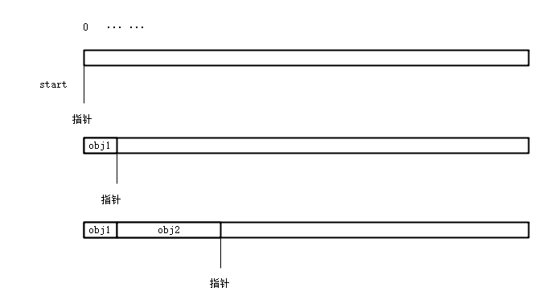

## 垃圾回收

#### GC

GC(garbage collector)中文译为垃圾回收器，.NET 中的 **GC** 指的是 CLR 中的**自动内存管理器**，GC 负责管理 .NET 程序的**内存分配和释放**。

GC 的优点如下：

* 自动管理内存，不必手动分配和释放；

* 高效管理托管堆上的对象；
* 智能回收对象，清除内存；
* 内存安全：避免野指针、悬空指针等情况造成严重错误；


### 内存

#### 物理内存

物理内存是物理内存条上的内存空间，是物理机器真实的容量大小。


#### 虚拟内存

虚拟内存(Virtual Memory)是计算机操作系统进行内存管理的一种技术，它可以将多个硬件、非连续地址的碎片空间组合起来，形成进程上可识别的连续内存空间。

虚拟内存由操作系统进行支持，如 Windows 上的虚拟内存，Linux 上的交互空间，虚拟内存需要操作系统映射到真实的内存地址空间才能使用。虚拟内存调度方式有分页式、段式、段页式3种，读者感兴趣可自行查阅资料。


现代操作系统都采用了虚拟内存管理技术，通过对物理存储设备的抽象，操作系统调度外存当作内存使用，提供了比物理内存更大的内存范围。

这些存储设备组成的内存称为虚拟地址空间，而用户（开发者）接触到的地址是虚地址，并不是真实的物理地址。虚拟空间大大拓展了内存，使得系统可以同时运行多道程序而不“吃力”。

虚拟地址空间分为两部分：用户空间、内核空间，每个程序运行时的会消耗两种空间。在 Linux 中比例是 3：1，在 Windows 中是 2：2。


### .NET 内存组成

.NET 中，内存分为非托管内存、托管内存。

.NET Core/.NET5+ 有一个称为 **dotnet** 的驱动程序，此驱动程序用于**执行命令或运行 .NET 程序**。当我们使用 dotnet 命令运行一个 .dll 文件时，操作系统会启动 dotnet 驱动程序，此时会分配操作系统内存资源、dotnet 驱动程序内存资源，这一部分即非托管资源，其中 dotnet 部分的内存包含了 CLR 等部件的内存。即使你并没有使用到 C/C++ 等非托管代码或者使用非托管资源，也会使用到非托管内存。

接下来 CLR 将初始化新进程，CLR 将为其分配托管内存(**托管堆**)，这段托管内存是一个连续的地址空间区域。.NET 安全代码只能使用托管内存，不能直接使用物理内存，垃圾收集器会为安全代码在托管堆上分配和释放虚拟内存。

显然， dotnet 的工作原理十分复杂，笔者没有能力讲清楚，感兴趣的读者可以自行查阅资料。


### CLR 中的内存

微软 .NET CLR 文档中写道：By default, on 32-bit computers, each process has a 2-GB user-mode virtual address space.

即在 32 位系统中，.NET 进程会使用 2GB 的用户模式虚拟内存，其虚拟地址空间的表示范围是 0x00000000 到 0x7fff；而 64 位系统中，地址范围是  0x000'00000000 到0x7FFF'FFFFFFFF，约等于 16TB。

从以上信息，我们知道 .NET 程序会消耗比较多的虚拟内存，如果在 64 位操作系统上运行 .NET 程序，其用户模式虚拟地址空间可能远远大于 2GB。

编写一个 "c1" 程序，其代码如下：

```csharp
        static void Main(string[] args)
        {
            Console.WriteLine("Hello World!");
            Console.Read();
        }
```
在 Linux 中使用 dotnet xx.dll 命令运行程序，然后查看其占用的资源：
```
 VIRT    RES    SHR S  %CPU  %MEM     TIME+ COMMAND
  3.1g   0.0g   0.0g S   0.3   0.3   0:00.83 dotnet
```

使用 dotnet-counters 查看 dotnet 进程：

```csharp
    GC Heap Size (MB)                                              0
    Gen 0 GC Count (Count / 1 sec)                                 0
    Gen 0 Size (B)                                                 0
    Gen 1 GC Count (Count / 1 sec)                                 0
    Gen 1 Size (B)                                                 0
    Gen 2 GC Count (Count / 1 sec)                                 0
    Gen 2 Size (B)                                                 0
    LOH Size (B)                                                   0
```

注：使用 dotnet run 运行 .NET 项目，会出现 dotnet、c1 两个进程，可以看到会产生 dotnet 和 c1 两个进程，dotnet 是驱动程序，dotnet 启动后，CLR 会将. dll 程序集编译，并初始化启动一个进程。


CLR 中的虚拟地址空间需要位于一个地址块中，因为在请求虚拟内存分配时，虚拟内存管理器必须找到满足需求的单个可用块，例如就算存在大于 2GB 的虚拟地址空间，但如果不是连续的，则会分配失败。如果没有足够的可供保留的虚拟地址空间或可供提交的物理空间，则可能会用尽内存。


#### CLR 虚拟内存状态


CLR 中的虚拟内存可以有三种状态:

| State           | Description                                                  |
| :-------------- | :----------------------------------------------------------- |
| Free 可用       | The block of memory has no references to it and is available for allocation. 内存块没有对它的引用，可以进行分配 |
| Reserved保留    | The block of memory is available for your use and cannot be used for any other allocation request. 该内存块可供您使用，不能用于任何其他分配请求 However, you cannot store data to this memory block until it is committed. 但是，在提交数据之前，不能将数据存储到此内存块中 |
| Committed已提交 | The block of memory is assigned to physical storage. 内存块已指派给物理存储 |


#### 内存分配

CLR 在初始化新进程时，会为进程保留一个连续的地址空间区域，这个地址空间被称为托管堆。托管堆中维护着一个指针，最初此指针指向托管堆的基址，这个指针是向后移动的。当需要分配内存时，CLR 便会分配位于此指针后的内存区域，同时指针指向此对象地址空间之后的位置。



由于 CLR 通过向指针添加值来为对象分配内存，所以它的分配速度几乎跟从堆栈中分配内存速度一样快；而且连续分配的新对象连续存储在托管堆中，程序可以快速地访问这些对象。

当 GC 回收内存时，一些对象释放后内存会被回收，这样托管堆地内存处于碎片化，之后整个内存段会被压缩，重新组成连连续的内存段，指针会被重置到对象的末尾。

当然，大对象堆(LOH)回收并不会压缩内存段，这一点我们后面再讨论。


#### 内存释放


### 垃圾回收的条件

根据微软官方文档，整理的垃圾回收条件如下：

* 系统物理内存不足；
* 托管堆分配的内存已超出可接受阈值；(当然，这个阈值会被动态调整)
* 手动调用 GC 类的 API(例如 GC.Collect)；


### 托管堆

#### 本机堆(Native Heap)

前面提到过，.NET 的内存有非托管内存和托管内存。CLR 运行的进程，存在本机堆和托管堆两种内存堆，本机内存堆通过 Windows API 的 [VirtualAlloc](https://docs.microsoft.com/zh-cn/windows/desktop/api/memoryapi/nf-memoryapi-virtualalloc) 函数分配，提供给 操作系统和 CLR 使用，用于非托管代码所需的内存。

#### 托管堆(Managed Heap)

关于托管堆，前面已经写了，这里不再赘述。


#### 托管堆代数

托管堆中的内存被分为三代，分别使用0、1、2 标识，GC 分配的内存首先在 0 代托管堆中，当进行垃圾回收时，如果对象没有被释放，则将其升级并存储到 1 代托管堆中。1 代托管堆进行内存回收时，不被释放的对象也会被升级到 2 代内存中，然后 1 代内存堆进行空间压缩。

托管堆的管理是 GC 负责的，而 GC 进行内存分配和释放，使用了 GC 算法。

GC 算法基于以下理论：

* ① 压缩托管堆的一部分内存要比压缩整个托管堆速度快；
* ② 较新的对象生命周期较短，较旧的对象生命周期较长；
* ③ 较新的对象趋向于相互关联，并且大约在同一时间被应用程序访问；

我们必须深刻理解这些理论，才能深入理解托管堆的设计。

关于 0 到 2 代堆，其基本说明如下：

* 0 代：0 代中的对象拥有短暂的生命周期，垃圾回收最常发生在此代中；
* 1 代：作为生命周期较短和生命周期较长对象的缓冲区。
* 2 代：存储生命周期长的对象；0、1 代没被回收而升级的对象会升级到 2 代中，静态数据等则会一开始就分配到 2代。


#### 存活和代数提升


---

参考资料：

【CLR】:[https://docs.microsoft.com/zh-cn/dotnet/standard/clr](https://docs.microsoft.com/zh-cn/dotnet/standard/clr)